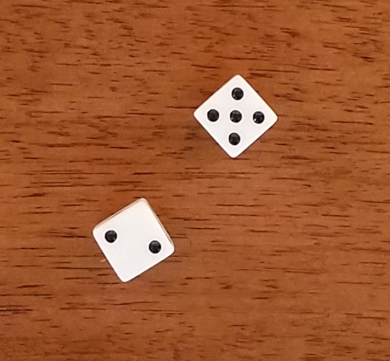

# Count_Dice_Dots
Detect and count dots on dice using C++ with OpenCV on visual studio (a task from Nascent technology)

## How can you get started
https://docs.opencv.org/2.4/doc/tutorials/introduction/windows_visual_studio_Opencv/windows_visual_studio_Opencv.html 
https://www.youtube.com/watch?v=l4372qtZ4dc 
Above are tutorial webisites which tell you how to install OpenCV library on visual studio platform, following are steps: 
* Download OpenCV on https://opencv.org/releases.html 
* Setting environment variable:PC->Properties->Advanced system setting->Environment variables->Path 
->Edit->New->OpenCV bin directory 
* Open new projects: Open Visual studio->File->New project->Visual C++->Win32 Console application->Finish 
* Choose configuration: Configuration manager->Active solution platform->New->Choose x86 or x64 platform  
* Set include path: Project->Properties->C/C++->Additional include directories->Opencv include directory 
* Add library directories:Project->Properties->linker->General->Additional library directories->Opencv lib directory 
* Add library dependency:Project->Properties->linker->Input->Additional dependecies->opencv_world300d.lib 
* Download msvcp120d.dll and msvcr120d.dll to main.exe folder  
* Copy all file into your project folder 
* Build and run Count_Dice_Dots.cpp and have fun!  

## Goal of this work
* The goal of this program is to detect contour of multiple dice and count numbers of dots

* Input image

* Output image

## How does this work
* The goal of this program
