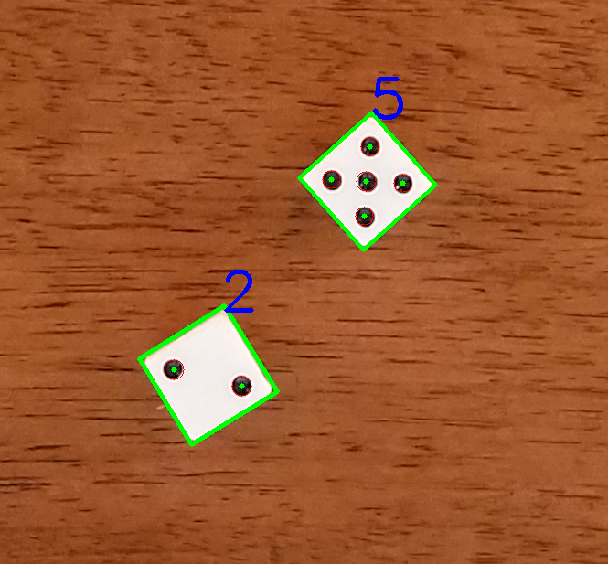

# Count_Dice_Dots
Detect and count dots on dice using C++ with OpenCV on visual studio (a task from Nascent technology)

## How can you get started
https://docs.opencv.org/2.4/doc/tutorials/introduction/windows_visual_studio_Opencv/windows_visual_studio_Opencv.html 
https://www.youtube.com/watch?v=l4372qtZ4dc 
Above are tutorial webisites which tell you how to install OpenCV library on visual studio platform, following are steps: 
* Download OpenCV on https://opencv.org/releases.html 
* Setting environment variable:PC->Properties->Advanced system setting->Environment variables->Path 
->Edit->New->OpenCV bin directory 
* Open new projects: Open Visual studio->File->New project->Visual C++->Win32 Console application->Finish 
* Choose configuration: Configuration manager->Active solution platform->New->Choose x86 or x64 platform  
* Set include path: Project->Properties->C/C++->Additional include directories->Opencv include directory 
* Add library directories:Project->Properties->linker->General->Additional library directories->Opencv lib directory 
* Add library dependency:Project->Properties->linker->Input->Additional dependecies->opencv_world300d.lib 
* Download msvcp120d.dll and msvcr120d.dll to main.exe folder  
* Copy all file into your project folder 
* Build and run Count_Dice_Dots.cpp and have fun!  

## Goal of this work
* The goal of this program is to detect contour of multiple dice and count numbers of dots

* Input image

 

* Output image

## How does this work
* There are three major steps to achieve the goal: Binarization, Find contour, Hough circle detection.

* Binarization: To automatic binarize input image into foreground(dice area) and background(wooden table), Otsu's threshold method is applied. Otsu's threshold is a automatic thresholding method base on finding optimal threshold value which have maximum between-class variance between foreground and background. However, when histogram of input image is not bimodal, to be specific, when input image is dice3.png, which have no dice but only wooden table. In this case, the Otsu's method will fail. Therefore, In the automatic binarization step, I applied weighted Otsu's method(Yuan, 2015) to enforce the optimal threshold close to zero when the histogram is monomodal. 

Ref. X.-C. Yuan, L.-S. Wu, and Q. Peng, “An improved Otsu method using the weighted object variance for defect detection,” Applied Surface Science, vol. 349, pp. 472–484, 2015.

* Find contour: After binarization, the contour of dice can be easily located using findContours function in OpenCV. Detailed discussion of parameters of findContours function and example code list in below websites.
https://docs.opencv.org/2.4/modules/imgproc/doc/structural_analysis_and_shape_descriptors.html?highlight=findcontours#findcontours
https://docs.opencv.org/2.4/doc/tutorials/imgproc/shapedescriptors/find_contours/find_contours.html

* Hough circle detection: Since the dots in dice is in circle shape, HoughCircles function in OpenCV is applied to find dots in each dice. The detail discussion of parameters and exmaple codes of HoughCircles function list in below websites.
https://docs.opencv.org/2.4/doc/tutorials/imgproc/imgtrans/hough_circle/hough_circle.html

